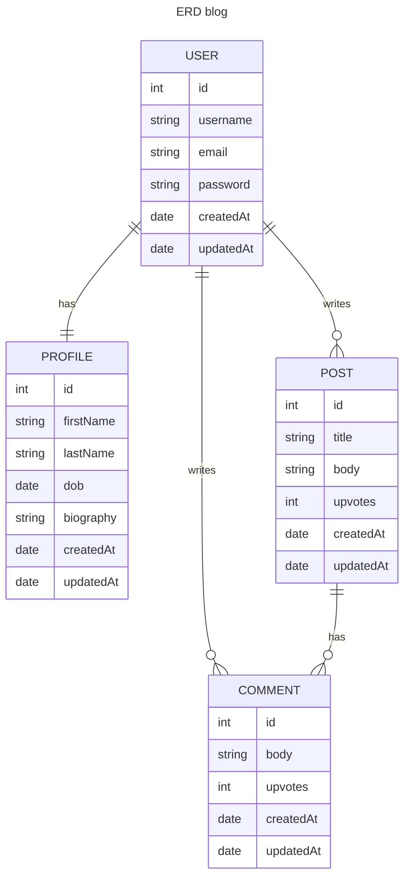

```mermaid
---
title: ERD blog
---
erDiagram
    USER {
        int id
        string username
        string email
        string password
        date createdAt
        date updatedAt
    }
    USER ||--|| PROFILE: has
    PROFILE {
        int id
        string firstName
        string lastName
        date dob
        string  biography
        date createdAt
        date updatedAt
    }
    USER ||--o{ POST: writes
    POST {
        int id
        string title
        string body
        int upvotes
        date createdAt
        date updatedAt
    }
    USER ||--o{ COMMENT: writes
    COMMENT {
        int id
        string body
        int upvotes
        date createdAt
        date updatedAt
    }
    POST ||--o{ COMMENT: has
```